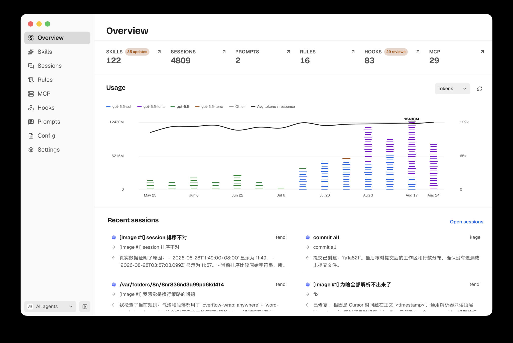
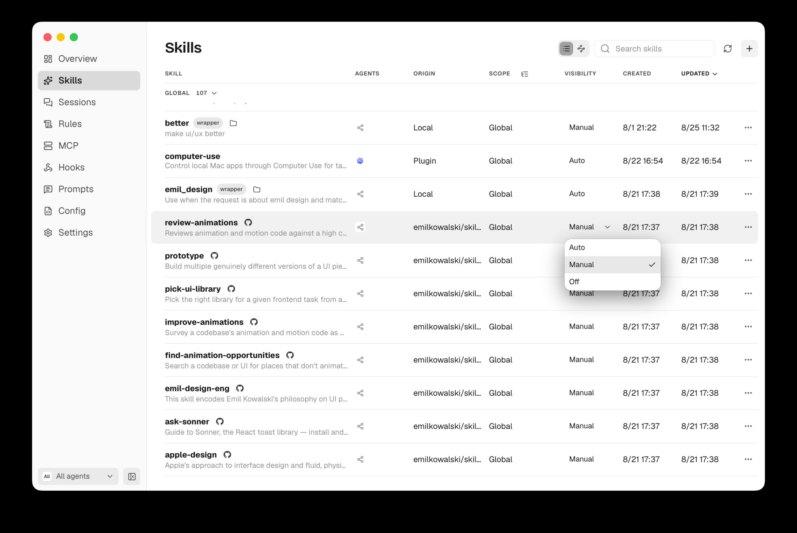
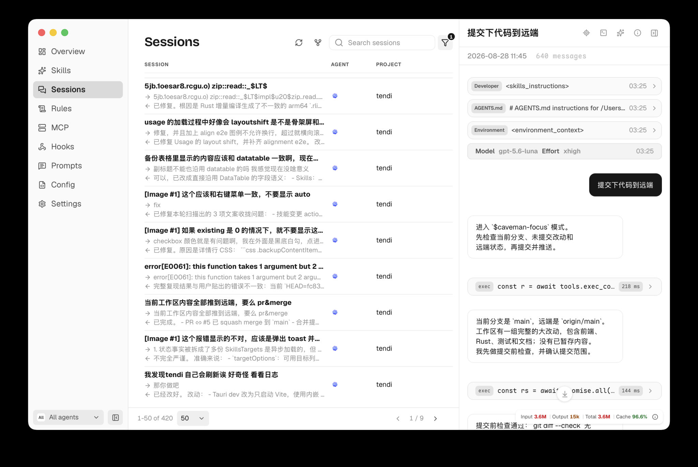

<div align="center">
  <br />
  
  <h1>tendi</h1>
  <p>
    A local-first macOS app for <strong>Codex</strong>, <strong>Cursor</strong>, and <strong>Claude Code</strong>.<br />
    Browse sessions, manage skills, and keep rules, hooks, MCP, and config in one place — with a matching CLI.
  </p>
  <p>
    <a href="./README.zh-CN.md">中文</a>
    &nbsp;·&nbsp;
    <a href="https://github.com/rhinoc/tendi/releases">Releases</a>
    &nbsp;·&nbsp;
    <a href="./LICENSE">License</a>
    &nbsp;·&nbsp;
    <a href="./CONTRIBUTING.md">Contributing</a>
  </p>
  <br />
</div>

## Screenshots

<table>
  <tr>
    <td align="center">
      
      <br />
      <sub>Overview and usage trends</sub>
    </td>
    <td align="center">
      
      <br />
      <sub>Skills</sub>
    </td>
    <td align="center">
      
      <br />
      <sub>Sessions</sub>
    </td>
  </tr>
</table>

## Features

- 📊 **Usage** — Overview shows token usage and trends across sessions, turns, models, tools, and skills. Each session exposes cache rate and token usage.
- 🧩 **Skills** — Install, edit, update, and set visibility (`auto` / `manual` / `off`). Local edits to remote skills survive upstream updates through three-way merge.
- 💬 **Sessions** — Read transcripts as an IM-style thread, including injected prompts and tool-call detail that agent UIs often omit, then resume in place.
- 🎛️ **Config** — Switch agent config profiles quickly — for example when rotating API keys — without digging through provider files.
- 📜 **Rules, hooks, and MCP** — Browse provider-owned configuration in one place, open source files, and apply supported changes.
- 🔄 **Sync** — Snapshot skills, MCP, rules, and hooks to a Git repo, then restore with an explicit plan.
- 🖥️ **Desktop and CLI** — The app and `tendi` share the same local scanner and snapshot database.

## Why Tendi

Tendi is for people who already run more than one coding agent.

In that setup, sessions are scattered across apps, skills accumulate on `auto`, and remote skills are awkward to customize because the next update may overwrite local changes. Tendi keeps Codex, Cursor, and Claude Code on one local surface, and focuses on a few concrete gaps:

- Unused skills left on `auto` still contribute description text every turn. Set them to `manual` or `off` from one list.
- Search, review, and resume sessions across agents instead of rebuilding context after switching tools.
- Edit installed remote skills locally; pull upstream updates with three-way merge rather than overwrite-or-fork.

If you use a single agent and rarely touch skills or old sessions, the agent apps alone are usually enough.

## Requirements

- **macOS** on Apple Silicon for the desktop app.
- At runtime, network access is used only for skill sources, marketplace search, update checks, or a sync remote you configure.

## Install

Download the latest **`tendi-<version>-aarch64.dmg`** from **[GitHub Releases](https://github.com/rhinoc/tendi/releases)**.

1. Open the DMG.
2. Drag **`tendi.app`** to **Applications**.
3. Eject the disk image, then launch **Tendi** from Applications or Spotlight.

The app also ships the `tendi` CLI. Install it from the first-run prompt, or later under **Settings → Developer → Coding helpers**.

Installed apps can check for updates under **Settings → Updates**.

### First launch and Gatekeeper

Browser downloads are quarantined by Gatekeeper. Release and local builds are not Apple Developer ID-signed or notarized yet. If macOS blocks the app, confirm the DMG source, move `tendi.app` to Applications, then:

```bash
xattr -dr com.apple.quarantine /Applications/tendi.app
```

## Usage

### Desktop

Views: **Overview**, **Skills**, **Sessions**, **Rules**, **MCP**, **Hooks**, **Prompts**, **Config**, and **Settings**.

Common paths:

- **Skills → Add** — Paste a Git URL or path, or search a marketplace, preview, then install.
- **Sessions** — Search transcripts, open detail, resume into Codex, Cursor, or Claude Code.
- **Settings → Developer → Sync** — Point at a Git repo, choose what to include, sync, and restore from history.

### CLI

After installing the CLI:

```bash
tendi scan
tendi skills list
tendi sessions search "your query"
tendi rules list
tendi hooks list
tendi mcp list
```

Commands that change files show a plan first. Use `--dry-run` to preview without writing, and `--yes` to confirm non-interactively.

When you install the CLI, you can also install Tendi's bundled skill at `~/.agents/skills/tendi`, so coding agents can search local sessions and manage skills. Skip it if you prefer, or install later from **Settings → Developer → Coding helpers**.

See `tendi --help` for all commands.

### Local data

| Location | What it stores |
| --- | --- |
| `~/Library/Application Support/tendi/tendi.sqlite3` | Local snapshot database |
| `~/.agents/skills`, `~/.codex/skills` (or `$CODEX_HOME/skills`), `~/.cursor/skills`, `~/.claude/skills` | Global skill roots Tendi scans |
| Project `.agents` / `.codex` / `.cursor` / `.claude` trees | Project skills, rules, hooks, and MCP when a project context is set |

Scanning runs entirely on local files. Remote access only occurs for skill sources, marketplace or update checks, and sync remotes you configure.

## Contributing

See **[CONTRIBUTING.md](./CONTRIBUTING.md)** for setup, conventions, tests, assets, and release boundaries. Focused notes live under **[docs/](./docs/README.md)**.

## License

The Rust workspace and source repository use the [MIT License](LICENSE). Third-party dependencies and bundled assets retain their own licenses and attribution requirements.

The Tendi app icon and DMG background are project assets. New fonts, media, or other binary assets must include source, license, attribution, and redistribution terms before landing in the public repository.
